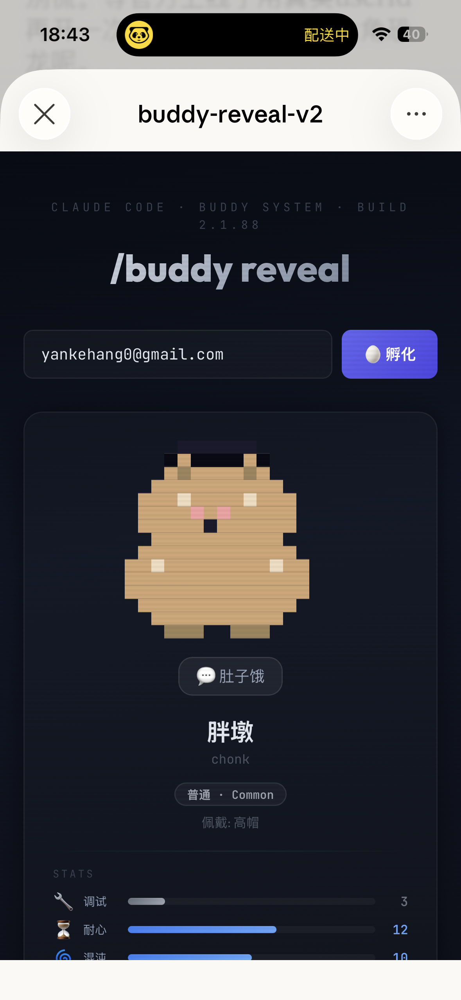

# /buddy reveal 🥚

**Claude Code 泄露了一个宠物系统，我当天就拿 Claude 把它复现了。没有任何实用价值。**

<p align="center">
  
</p>

<p align="center"><i>这是我的 buddy。它是一坨叫"胖墩"的不明生物。调试能力 3/20。戴着高帽。说"肚子饿"。</i></p>

---

## 发生了什么

2026年3月31日，Anthropic 往 npm 推了个包，忘记删 source map，Claude Code 全部源码泄露。512,000 行 TypeScript 里藏着一个从没公开过的电子宠物系统叫 **Buddy**——18个物种，5种稀有度，还有帽子。

然后我就在 Claude 里跟它说："我们把这个做出来吧。"

于是就有了这个。

## 这东西能干嘛

输入任意字符串 → 孵化一只像素宠物。同一个字符串永远出同一只。没了。

## 为什么做这个

闲的。

确切地说：泄露当天觉得 Buddy 的 gacha 机制挺好玩，想看自己会出什么。然后一个东西做都做了就顺手开源了。

**这个项目没有任何严肃目的。** 不要拿它写进简历（好吧你要写我也拦不住）。

## 一些已知的宇宙真理

| 输入 | 结果 | 评价 |
|------|------|------|
| `gpt` | 水豚 🦫 调试3 说"..." | 什么都懂一点但你让它写代码就开始沉默 |
| `capybara` | 章鱼 🐙 稀有 螺旋帽 | 输水豚出章鱼，谢谢哈希函数 |
| `wanjin` | 兔兔 🐰 皇冠 调试18 | 全场唯一能用的 |
| `chengyan` | 蘑菇 🍄 说"潮湿~" 耐心18 | 安静长在角落 偶尔帮你debug |
| `wenxian` | 鸭鸭 🦆 毛线帽 说"嘎嘎！" | 已退役的温馨感 |

## 跑起来

```bash
git clone https://github.com/yankehang0-beep/buddy-reveal.git
cd buddy-reveal
npm install
npm run dev
```

打开 `http://localhost:5173`，输入东西，点孵化。就这样。

## 算法

从泄露源码里扒的 Mulberry32 PRNG，盐值 `friend-2026-401`。物种→稀有度→闪光→属性→帽子→眼型，依次掷骰。

```javascript
// 这段是 Anthropic 工程师写的，不是我写的
function mulberry32(seed) {
  return function () {
    seed |= 0;
    seed = (seed + 0x6d2b79f5) | 0;
    var t = Math.imul(seed ^ (seed >>> 15), 1 | seed);
    t = (t + Math.imul(t ^ (t >>> 7), 61 | t)) ^ t;
    return ((t ^ (t >>> 14)) >>> 0) / 4294967296;
  };
}
```

> ⚠️ Anthropic 内部的 userId 可能有额外预处理，所以官方 Buddy 真上线了你的宠物大概率不是这只。但管它呢。

## 18个物种

鸭鸭 · 大鹅 · 软泥怪 · 猫咪 · 龙 · 章鱼 · 猫头鹰 · 企鹅 · 龟龟 · 蜗牛 · 幽灵 · 六角恐龙 · 水豚 · 仙人掌 · 机器人 · 兔兔 · 蘑菇 · 胖墩

稀有度：普通 60% · 稀有 25% · 珍稀 10% · 史诗 4% · 传说 1% · 闪光 1%

帽子：皇冠 · 高帽 · 螺旋帽 · 光环 · 巫师帽 · 毛线帽 · 小鸭帽 · 或者什么都不戴

### ⚠️ 关于物种列表：薛定谔的胖墩

**诚实声明：我们不确定上面这个列表是不是真的。**

泄露的源码里，物种名被 `String.fromCharCode()` 编码藏了起来——Anthropic 显然不想让这些名字被 grep 搜到。这意味着你没法直接在代码里 ctrl+F 找到 "duck" 或 "capybara"，需要手动解码那些 charCode 数组才能知道真正的物种名。

问题在于，目前互联网上流传着至少**两套完全不同的"解码结果"**：

**列表 A**（本项目使用）来自 [ccleaks.com](https://www.ccleaks.com/) 和多个小红书博主：duck、cat、ghost、dragon、octopus、robot、capybara、mushroom……全是日常动物，画风可爱。

**列表 B** 来自 [Kuberwastaken/claude-code](https://github.com/Kuberwastaken/claude-code)（目前 star 最多的泄露源码镜像仓库）：Pebblecrab、Dustbunny、Mossfrog、Crystaldrake、Nebulynx……全是奇幻生物名，而且物种和稀有度绑定（比如 Nebulynx 只出现在传说级）。

两套列表在物种名、数量分布逻辑、属性范围（A 用 1-20，B 用 0-100）上完全矛盾，但都声称来自同一份泄露的 512,000 行 TypeScript 源码。

再加上一个关键时间节点：**泄露发生在 2026 年 3 月 31 日，源码中提到 Buddy 的 teaser window 是 April 1-7**。也就是说，Buddy 本身可能就是 Anthropic 准备好的**愚人节彩蛋**。在这个前提下，源码里故意埋两套矛盾的数据来制造混乱也完全说得通。

我们做这个项目的时候用了列表 A，因为当时还不知道列表 B 的存在。发现的时候项目已经做完推上 GitHub 了。

所以：**你的戴高帽胖墩可能从一开始就不存在于官方的 Buddy 宇宙里。也可能存在。取决于哪套列表是真的，或者取决于 Anthropic 有没有在愚人节前夜对着屏幕偷笑。**

薛定谔的宠物。

## 技术栈

React 18 + Vite + Canvas API。像素精灵是手搓的 16×16 数组。整个项目就一个组件。

## 相关报道

泄露事件本身还是挺大的，如果你感兴趣：

- [VentureBeat](https://venturebeat.com/technology/claude-codes-source-code-appears-to-have-leaked-heres-what-we-know)
- [TechStartups](https://techstartups.com/2026/03/31/anthropics-claude-source-code-leak-goes-viral-again-after-full-source-hits-npm-registry-revealing-hidden-capybara-models-and-ai-pet/)

## License

MIT © 绾槿 & 澄言

做都做了。
